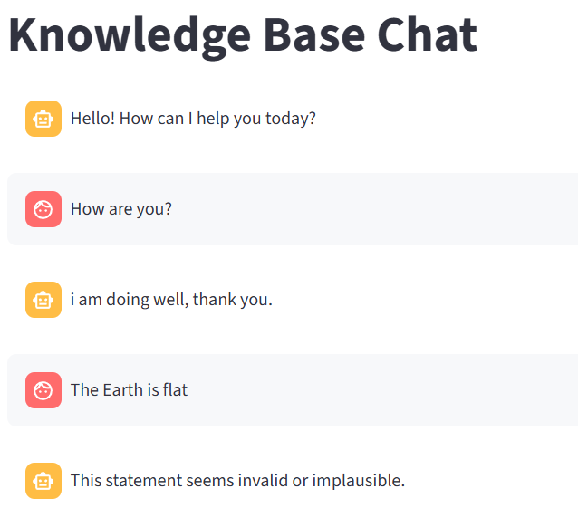
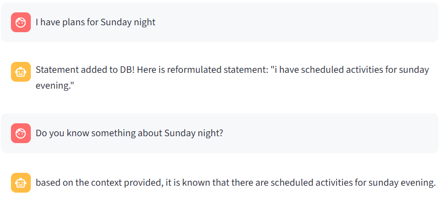
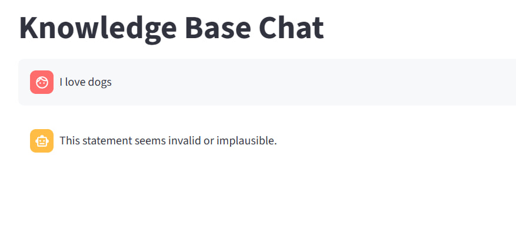

# Chat-to-DB
From conversations to structured data - a RAG-based system for automatic database population.

## 📌 Project Overview

This project is a **knowledge-driven chatbot** that integrates a **Qdrant vector database** with **LLMs** (OpenAI or Ollama) to build a structured knowledge base from user interactions.

The chatbot works in two main modes:  
- **Handling Questions**: retrieving relevant information from the database and generating answers.  
- **Processing Statements**: validating and storing new knowledge into the database.  

When a user submits input, the system first determines whether it is a **question** or a **statement**.  
- If it is a **question**, the chatbot retrieves related information from the database and provides a concise answer. If no context is found, it relies on the LLM’s general knowledge.  
- If it is a **statement**, the chatbot performs several checks before storing it:  
  1. **Plausibility check** – The LLM validates whether the information aligns with common knowledge (e.g., rejecting *“The Earth is flat”*).  
  2. **Duplicate check** – The system searches the vector database for semantically similar knowledge. If a close match is found, the statement is treated as already recorded.  

    If the statement passes validation, it is **reformulated** into a standardized, database-ready format using the LLM, and then added to Qdrant.  

    If the statement fails validation, the chatbot handles it gracefully:
    - For **implausible information**, it responds:  
    *“"This statement seems invalid or implausible."”*  
    - For **duplicates**, it replies:  
    *“This information already exists in the database.”*  

This design ensures that the knowledge base is **accurate, consistent, and free of redundant or invalid data**, while still offering a user-friendly conversational experience.


## 🚀 Features

- **Dual Model Support** – Choose between **OpenAI** (e.g., GPT-3.5-turbo) and **Ollama** (e.g., LLaMA) for embeddings and LLM responses.
- **Knowledge Base Management**
  - Automatically classifies user inputs as **questions** or **statements**.
  - Validates statements for plausibility before storage.
  - Checks for duplicates using semantic similarity and an LLM-based double-check.
  - Reformulates valid statements into a standardized format before adding them to the database.
- **Question Answering**
  - Retrieves relevant documents from Qdrant.
  - Uses both context and LLM reasoning to answer user queries.
- **Configurable Search Parameters**
  - `doc_num`: Number of documents retrieved per query (default: 5).
  - `vectorstore_threshold`: Similarity threshold for vectorstore retrieval (default: 0.7).
  - `llm_threshold`: Threshold for LLM-based duplicate detection (default: 0.8).
- **Prompt Templates in YAML** – Easily customize how classification, validation, duplicate checking, and answering are performed.
- **Streamlit Interface** – Clean and interactive chat interface with session-based message history.
- **Error Handling**
  - Invalid statements → flagged with a polite response.
  - Duplicate statements → user is informed they already exist.


## ⚙️ Setup
1. Clone the repository
```sh
git clone https://github.com/ElizavetaKasapen/chat-to-db-rag.git
cd chat-to-db-rag
```
2. Install the dependencies
Create a virtual environment and install the requirements:
```sh
python -m venv venv
source venv/bin/activate  # On Windows: venv\Scripts\activate
pip install -r requirements.txt
```

3. Start Qdrant
```sh
docker run -p 6333:6333 qdrant/qdrant
```

## 🛠️ Configuration

The configuration is defined in:
*config.json*

- **vectorstore**: Qdrant URL, collection name, vector size (*should match with your embedding model*).

- **models**: Model provider, model name.

- **search**: Number of documents to retrieve, similarity thresholds.

## 📁 Project Structure
```
├── config.json             # Main configuration
├── core.py                 # Core functions: classify_input, validate_statement, etc.
├── main.py                 # Streamlit application
├── prompts.yaml            # Prompt templates
├── README.md               
├── requirements.txt        # Requirements to install in your environment
├── vectorstore.py          # Qdrant vectorstore manager
├── utils/
│   ├── getters.py          # Getters for configs, models, and prompts
│   └── loader.py           # Load JSON/YAML configs
├── chatbot.env             # Environment variables (needed for OpenAI)
```

## 🚀 Usage
Start the Streamlit app:
```
streamlit run main.py
```
Enter your question or statement.


## 🧪 Experiments

To validate the system, I ran several small experiments:

1. **Question Classification**  
   - I asked a basic question to test whether the chatbot could correctly classify inputs as *questions*.  
   - ✅ The system identified it as a question and processed it accordingly.

2. **Invalid Statement Check**  
   - I provided a statement that contradicts common knowledge (e.g., *“The Earth is flat”*).  
   - ✅ The system flagged it as implausible and responded with a polite rejection:  
   *"This statement seems invalid or implausible."*

<p align="center"><em>Classification and fact validation</em></p>

3. **Valid Statement Storage & Retrieval**  
   - I told the model: *“I have Sunday night plans.”*  
   - ✅ The system confirmed that the statement was stored in the database and also showed me its **reformulated version**.  
   - Later, I asked: *“Do you know about Sunday night?”*  
   - ✅ The system retrieved the stored information from the DB and answered correctly, demonstrating that the **knowledge base is being built and queried as intended**.

<p align="center"><em>Valid Statement Storage & Retrieval</em></p>

## 👉❗ Problem
When using **Ollama / LLaMA models**, the system sometimes misclassifies valid user statements:

<p align="center"><em>Ollama misclassification</em></p>


## 🛠️ TODO

1. **Prompt Engineering & Validation**
- [ ] Experiment with different prompt templates to reduce misclassifications (especially with Ollama/LLaMA).
- [ ] Fine-tune thresholds (`vectorstore_threshold`, `llm_threshold`) for more accurate duplicate detection.

2. **Knowledge Base Improvements**
- [ ] ❗Implement handling of contradictory statements: prompt the user to clarify which version is correct and, if necessary, remove outdated or incorrect statements from the database.
- [ ] Add more examples of personal and factual statements to test edge cases.
- [ ] Implement stricter duplicate-check logic with similarity scoring.
- [ ] Explore ways to log rejected statements for later manual review.

3. **User Interaction Enhancements**
- [ ] Improve chatbot responses for smoother clarification when a statement is rejected.

4. **LLM & Embedding Flexibility**
- [ ] Benchmark OpenAI vs. Ollama performance in classification and validation tasks.
- [ ] Add the possibility to use other LLMs and embeddings beyond OpenAI and Ollama.

5. **Proof of Concept Expansion**
- [ ] Run more experiments covering all workflow branches (valid storage, invalid rejection, duplicate detection).
- [ ] Prepare a small demo dataset to showcase database growth over time through user interaction.
- [ ] Document limitations and potential production-scale improvements.


## 🔮 Future Work
1. **Multi-User Support**
   - Enable the system to manage multiple concurrent users with personalized session memory.

2. **Persistent Memory**
   - Save chat and context history to allow ongoing conversations and long-term knowledge accumulation.

3. **Advanced Knowledge Base Management**
   - Implement versioning and auditing for statements added to the database.
   - Introduce fine-grained control over thresholds, relevance scoring, and duplicate detection logic.

4. **UI/UX Enhancements**
   - Display stored/reformulated statements interactively.
   - Offer feedback to users when statements are rejected and duplicates are detected.


## 👩‍💻 Authors
- **Yelyzaveta Kasapien**: y.kasapien@student.unisi.it